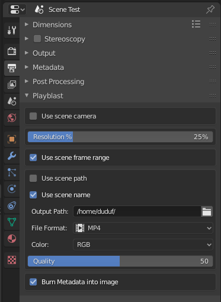

# *DuBlast* Output Settings

The output settings for *DuBlast* are located in the *Output Settings* Tab of the *Properties* panel.

## Camera

Use the *Use scene camera* option to force the rendering process to use the camera instead of the current view.

## Resolution

The resolution is a percentage of the output dimensions.

!!! note
    When rendering to *MP4* (the default), *DuBlast* will automatically adjust the dimension of the playblast to fit *MP4* requirements (an even number of columns and lines). This will not affect the scene output settings.

## Frame range

Uncheck the *Use scene frame range* option to set a custom frame range for the playblast, different from the scene.

## Output

You can set a custom output path for the playblast, different from the scene/render output.

A few formats are available (*PNG*, *JPEG*, *AVI JPEG* and *MP4*); all of them are presets carefully crafted to be animator friendly (easy to seek and play). The default is *MP4*, which will make smaller files for the same quality and can be played easily with any player on any system. These *MP4* files have custom settings to enable frame by frame seeking. They're also very fast to encode when creating the playblast.

## Metadata

You can burn the metadata defined in the scene properties into the image.

!!! hint
    The font size set in the scene settings will be scaled according to the *Resolution* setting of the playblast, so that the metadata text is the same size both in the 100% output of the scene and the scaled down playblast
